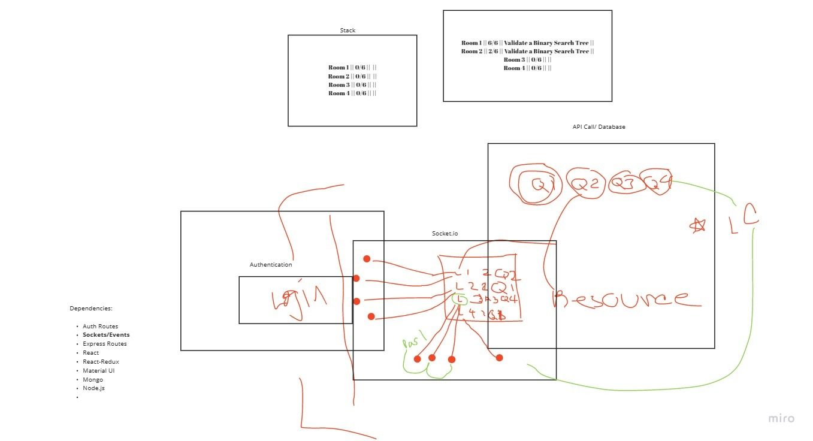
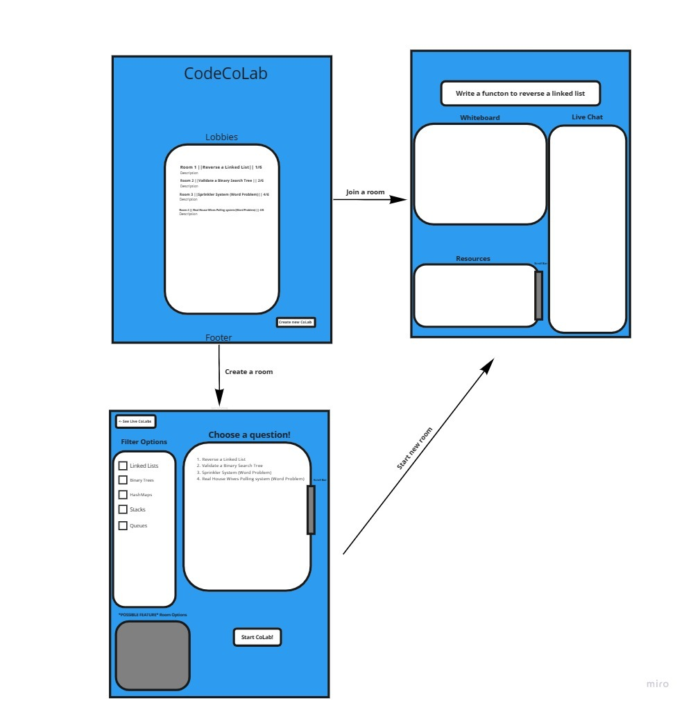

# 401 Final Group Project Team Agreement

## Project Title: Code CoLab

## Group Name: Code CoLab

## Team Members: Clement Buchanan, Taylor Thorton, Kale Lesko and Terrence Jamal Simms

### The name of our project is: Code CoLab

### Project Summary

As junior developers we often find ourselves at a loss for solving code. We often migrate to Stack Overflow or LeetCode for answers that are in abundance. However, we're sometimes still at a loss as to how the answers came about. Code CoLab is a hybrid providing the best of both worlds allowing for junior developers not only to find the answers they seek but also to Code CoLab with others on how to solve them. At a minimum (MVP) Code CoLab will provide opportunities for:

1. Admin to see all resources posted by users to DSA questions
1. Users to join active Code CoLab rooms
1. Users can create new Code CoLab rooms and select questions to work on
1. Users can chat with other developers in the Code CoLab room as they work through problems
1. Users can "star" important communication shared in the chat to be stored as a resource for that problem

### Code CoLab Mockup and Wireframe

Code CoLab Mockup

Code CoLab Wireframe

### Links to Trello PM tool

[Trello board](https://trello.com/b/N2BCOzKw/code-colab)
